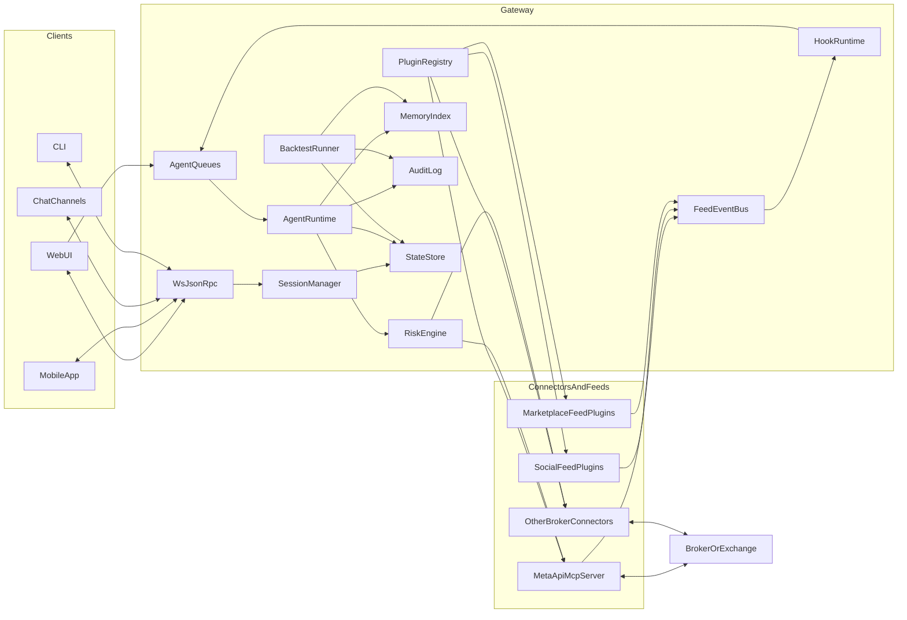

## Architecture overview (OpenClaw-inspired)

### 0) Why this architecture

We are intentionally borrowing OpenClaw’s core idea: **the gateway is the center of everything**.

OpenClaw reference (read this first): `https://www.globalbuilders.club/blog/openclaw-codebase-technical-guide`.

Trading has extra requirements compared to a general assistant:

- **Hard safety constraints** (risk limits, emergency stop)
- **Deterministic “always correct” actions** (cancel order, close position)
- **Event-driven triggers** (market data) instead of a human typing messages all day
- **Auditable execution** (why + what + when + inputs)

A gateway-centric architecture lets us:

- keep a single control plane for state, audit, and permissions
- plug in new brokers/feeds without rewriting the agent runtime
- apply consistent risk + tool policy across all execution paths
- support many clients (web first, then mobile, Telegram, WhatsApp, CLI) using one protocol

---

### 1) System diagram

Key idea: **everything is orchestrated through the gateway**, and all external systems are accessed through **connectors**.

---

### 2) The execution loop (trading-adapted OpenClaw model)

OpenClaw’s loop is:

- message arrives
- queue mode applied
- agent run started
- tools executed (with policy)
- output streamed

For trading, “message arrives” becomes:

- **FeedEvent arrives** (candle close, price tick, tweet)
- **Hook evaluates** deterministically
- Only if hook returns “wake” does the **agent** run

We explicitly split work into two tiers:

- **Deterministic tier** (hooks, risk checks, emergency stop)
- **LLM tier** (reasoning, narrative, strategy evolution)

This is the main lever to control cost and safety.

---

### 3) Core concepts & boundaries

#### 3.1 Gateway (control plane)
Owns:

- configuration
- sessions (who is connected, auth)
- plugin registry
- agent registry
- queues
- memory index
- audit log

Does not:

- directly embed broker-specific logic (that belongs to connectors)

#### 3.2 Connectors (capability providers)
Connectors provide capabilities such as:

- market data (candles, price)
- account state (balance, positions, orders)
- trade operations (place, modify, cancel)

Connectors must be **replaceable**.

For v2 MVP we will integrate MT5 via MetaAPI using the MCP server reference:

- `metatrade-metaapi-mcp-server` (MetaAPI MCP reference server; tool contract + tests)

#### 3.3 Feeds (event sources)
Feeds produce normalized events like:

- `market.candle.closed`
- `market.price.tick`
- `social.tweet`

The gateway does not care whether the feed is:

- streaming
- polled
- replayed from history

All of those are just event sources feeding the same bus.

#### 3.4 Hooks (deterministic triggers and strategies)
Two hook classes:

- **Wake Hooks**: decide whether to wake the agent
- **AutoTrade Hooks**: can emit a trade intent without waking the agent

Hooks are:

- deterministic
- sandboxed
- instrumented (time, errors, outputs)
- versioned artifacts in an agent workspace

#### 3.5 Agents (reasoning + protocol)
An agent is:

- a workspace (`SOUL.md`, `TRADING_MANUAL.md`, `hooks/`, `journal/`, `memory/`)
- a set of permissions (accounts, symbols, actions)
- queue settings
- budgets (max runs per hour)

Agents can spawn subagents for bounded tasks (backtesting, research, report writing).

#### 3.6 Memory (local-first, OpenClaw-inspired)
Memory sources:

- manuals and protocol docs
- journals and trade logs
- run transcripts
- strategy artifacts

Indexing begins with **SQLite FTS** (fast keyword search) and upgrades to **hybrid vector + FTS** later.

OpenClaw reference memory pattern:

- file sync → chunk → embed → SQLite (FTS + vectors) → hybrid search merge

#### 3.7 Risk engine (hard guardrails)
Every trade intent—whether from an agent or an auto-trade hook—must pass through:

- **hard constraints** (allowlists, position sizing, daily loss limits)
- **connector capability checks** (supported order types)
- **state checks** (market open, margin)

Risk engine is deterministic and must be test-first.

---

### 4) Data model (domain entities)

These are the “names that must exist” in the system:

- **Account**
  - connector type (metaapi)
  - account id
  - demo/live
  - permissions and health
- **Agent**
  - workspace path
  - allowed accounts/symbols/timeframes
  - queue settings and budgets
- **FeedEvent**
  - topic, symbol, timeframe, ts, payload
- **Hook**
  - type (wake/autotrade)
  - subscriptions
  - versioned file artifact
- **AgentRequest**
  - source (user, hook, scheduler)
  - priority
  - dedupe key
- **AgentRun**
  - run id
  - snapshot inputs
  - outputs (blocks)
  - produced intents
- **TradeIntent**
  - desired action (place/modify/cancel/close)
  - parameters
  - reason + provenance
- **TradeExecution**
  - connector result
  - broker ids
  - timing
- **RiskDecision**
  - allowed/blocked
  - constraint violations
- **BacktestRun**
  - dataset reference
  - strategy version
  - metrics + report
- **AuditEntry**
  - append-only record of every critical action

We’ll define these once and reuse them everywhere (gateway, UI blocks, storage).

---

### 5) Execution modes (safety posture)

We treat trading like deployments:

- **paper**: no broker execution; all intents simulated
- **demo**: broker execution allowed but only on demo accounts
- **live**: broker execution allowed on live accounts

Default is **paper** until explicit opt-in.

Even in `live`, the system should support:

- “require human approval for each trade”
- or “autopilot within constraints”

This is configured per agent and enforced by the gateway.

---

### 6) V1 reference and what changes in v2

V1 (reference): `mt5-claude-trader`

Note: v1 is not vendored into this repo; it is a separate reference codebase.

- 3-process architecture (MetaAPI streaming, Claude agent loop, FastAPI gateway)
- multiprocessing queues + shared state dict
- React dashboard

V2 differences:

- single **gateway control plane** with explicit subsystems
- connector integration via MCP (MetaAPI MCP server reference)
- explicit feed event bus + hook runtime
- explicit queue modes + budgets
- explicit memory index + citations
- explicit UI blocks contract

We keep what worked (Fast feedback dashboard, stable connector loop) but make the boundaries and contracts more explicit.

